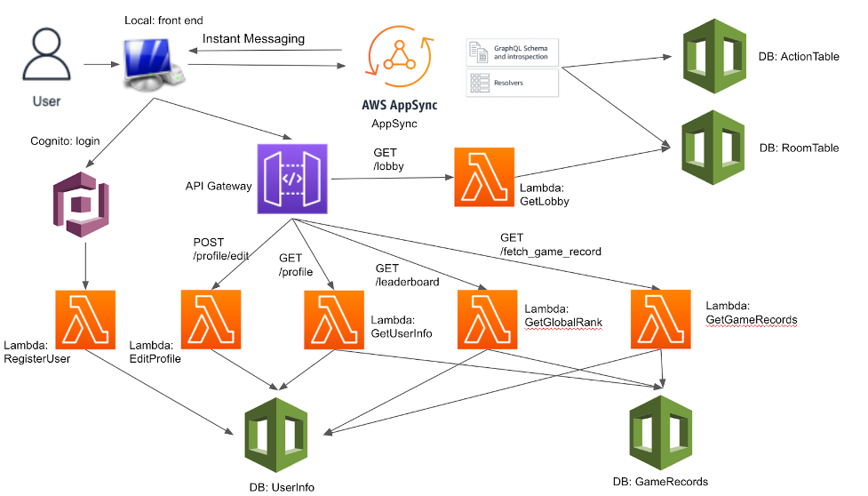

# PlayerX: A serious online rock-paper-scissors platform

## Introduction
Rock-paper-scissors has long been considered a childish game totally based on luck. People never treat it seriously. However, it definitely deserves more attention. Although the rules are easy, the minds are not. Take a look at this webpage[1] and we are sure you will be shocked by how persuasive these strategies are. Furthermore, they are more than theory. On an online rock-paper-scissors platform[2], we have achieved a over 60\% winning rate in tens of games with the strategies. (Warning: the game is very addictive)

But, wait!!! How can I share this huge discovery with my friends? The platform offers neither a game record, nor game stats. No one is going to believe me on that. This is so discouraging, and the only solution is: to develop our own platform.

PlayerX is an online serverless, multiplayer rock-paper-scissors platform that allow users to:
Register and log in with their accounts.
Play rock-paper-scissors with friends or strangers.
Share their game stats and watch the leaderboard to see their rankings.

## Playaround
```
python server.py
```

visit http://127.0.0.1:8888/ in new incognito window

## Architecture

The architecture is shown as below, all compnenets are provided by AWS, including API Gateway, Lambda, AppSync, DynamoDB, and Cognito.


## Project Details

In this section, we will talk about the details implementation of our project. When the user opens our web application, he/she needs to register or log in to the Lobby through Cognito.

### Cognito
The Cognito supports registration and logging in through Google, Amazon, and Facebook. When the registration completes, a lambda function will be triggered to add the user info to the table of UserInfo created and maintained in DynamoDB.

### AppSync
AWS AppSync is a fully managed service that makes it easy to develop GraphQL APIs by handling the heavy lifting of securely connecting to data sources like AWS DynamoDB, Lambda, and more. Adding caches to improve performance, subscriptions to support real-time updates, and client-side data stores that keep off-line clients in sync are just as easy. In this project, we utilize AppSync to receive updates from other users and notify those users who subscribe to relevant updates. Specifically, we will introduce more details about how AppSync is coupled with our project in the next few sections.

### Lobby & AppSync
When entering the lobby, the client will open a WebSocket and connect to the AppSync server. Specifically, this socket subscribes to and listens to RoomTable's update and delete events. In the lobby, the rooms that exist in the RoomTable will be listed and the user can choose to join one of them or create a new one. When a user tries to create a new room or join a room created by another user, the other user will receive notifications over the socket sent by the AppSync server.

### Room & AppSync
When a new room is created, the host will wait for other players to join. When a new player joins, the socket will monitor the change and refresh the room page to display the new user's information in the room. Players in the room can choose to start the game or exit the room. Since updates to the room state are immediately sent to the AppSync server via GraphQL, others who are listening to the server can be notified in time and make changes to the WebUI, such as redirecting to the playback page or removing other players out of the room. If the owner of the room decides to start the game, both players in the room will be redirected to the game page.

#### Play & AppSync
When the player starts to play the game, the action made by the player will be updated in the ActionTable through AppSync, and the update will be broadcast synchronously to all players who are listening to the table. If the player finds that the update comes from his opponent, the corresponding information is displayed in the front end. During the game, players can choose to quit the game at any time, and the game will not be recorded. When a player wins 4 rounds, the game will end, and the record of the game will be uploaded to the profile of the relevant player synchronously.

### LeaderBoard
In the leaderboard, players can see the information of all registered players. The information will be displayed according to the player's game-winning percentage and the total number of games played and sorted by score.

### Profile
On the profile page, players can find their personal information, including their avatar, username, winning percentage, the total number of game rounds, the probability of each action they made in the past games, and the last 5 game records. Players can also update their username and avatar by pressing the edit button. Currently, we only have 9 avatars to choose from, in the future, we may support players to customize their avatars.

## Reference
[1] https://www.livescience.com/15574-win-rock-paper-scissors.html

[2] https://www.rpsgame.org/
